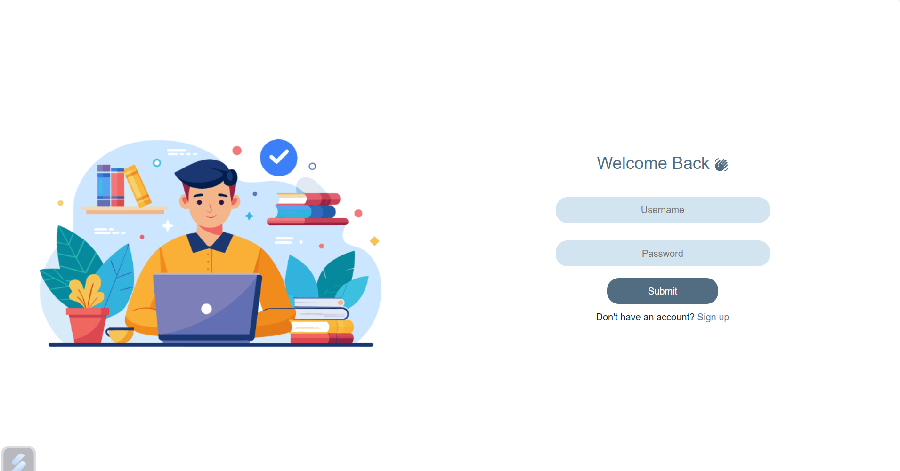

# Student Dashboard - MERN Stack

A **Student Dashboard** web application built using the **MERN** stack (MongoDB, Express.js, React.js, Node.js). This platform allows students to manage their profiles, assignments, courses, and communicate with others. It includes **authentication, authorization, and a responsive design** for a seamless user experience.

## ✨ Features

### 🏫 Student Management
- Add, delete, and view students in a tabular format.

### 💬 Messaging System
-  messaging between students (ui).

### 🧑 Profile Management
- Update and view personal information.

### 🔐 Authentication & Authorization
- Secure login .

### 📊 Dashboard
- View statistics, assignments, and courses.

### 📱 Responsive Design
- Hamburger menu for small screens.

### 📚 Courses & Assignments
- Track courses and assignments.

## 🛠️ Technologies Used

### Frontend:
- React.js
- React Router
- react-icons (for icons)
- CSS (for styling)

### Backend:
- Node.js
- Express.js
- MongoDB (Database)
- JWT (Authentication)


## 🚀 Installation

### Clone the repository:
```bash
git clone https://github.com/your-username/student-dashboard.git
cd student-dashboard
```

### Install dependencies:
#### Backend:
```bash
cd backend
npm install
```
#### Frontend:
```bash
cd ../frontend
npm install
```

### Set up environment variables:
Create a `.env` file in the **backend** directory:
```env
MONGO_URI=your_mongodb_connection_string
JWT_SECRET=your_jwt_secret_key
PORT=5000
```

### Run the application:
#### Start the backend server:
```bash
cd backend
npm start
```
#### Start the frontend development server:
```bash
cd ../frontend
npm start
```

### Access the application:
Open your browser and go to: **[http://localhost:3000](http://localhost:3000)**

## 📖 Usage

### 🔑 Login/Register
- Use the login/register page to create an account or log in.

### 📊 Dashboard
- View statistics, assignments, and courses.

### 🏫 Student Management
- Add, delete, or view students in the "Students" section.

### 💬 Messaging
- Send and receive messages in the "Message" section.

### 🧑 Profile
- Update your profile information in the "Profile" section.

## 📸 Screenshots

| Dashboard | Student Management | Messaging |
|-----------|-------------------|-----------|
|  |  |  |

---
**Contributions are welcome!** Feel free to fork this repository and submit pull requests. 😊


---
### ⭐ Don't forget to give this project a star if you find it useful! ⭐

